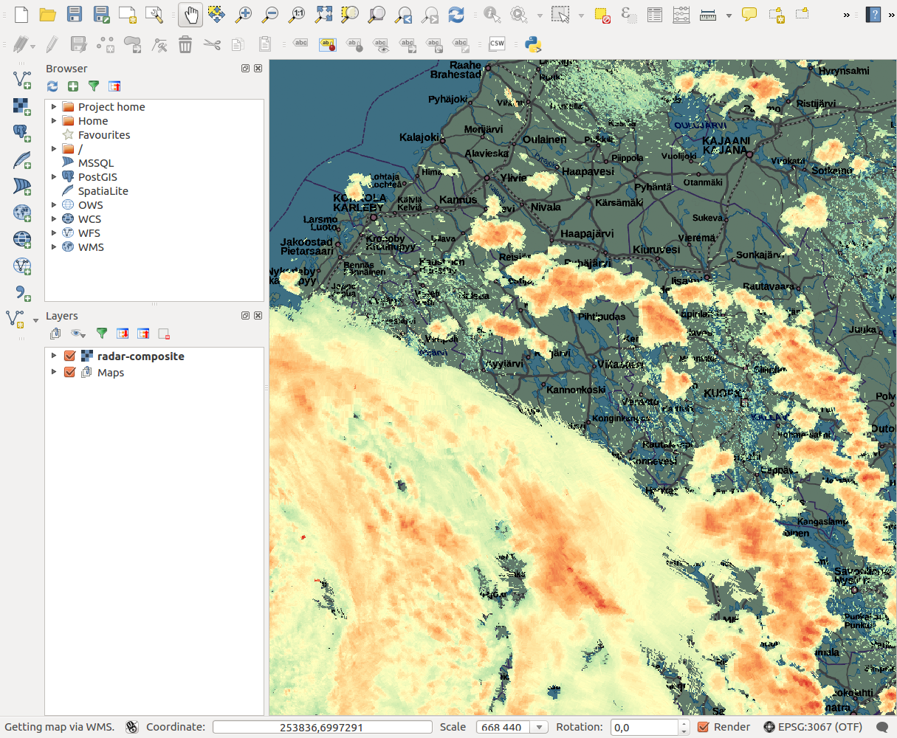

# Viewing FMI radar composites in QGIS

## QGIS

QGIS is an open source multi-platform software for viewing and processing geographical data.

* [Home page](https://qgis.org/)
* [Download](https://qgis.org/en/site/forusers/download.html)

## Sample data (2020/xx/yy 12:00 UTC):

This example uses GeoTIFF data linked below
* GeoTIFF
* For comparison: [HDF5 data](./composite.h5), [PNG image, grayscale](./composite.png), and [PNG image, coloured](./composite-rgb.png).

## Example

### Background map

* Add a background map service in the list of WMS'es, for example:
  [remark]: https://tiles.kartat.kapsi.fi/taustakartta?
* Add a group in the layer list below, renaming it to, say, "Background maps"

### Radar data

* Download radar data using instructions on page
  or use  in this documentation 
* Add the data as a separate layer above the background map(s).
  

* Double-click layer control and edit *Style*
* A traditional choice is to colour weak precipitation green, moderate rain
  yellow and intensive rain and/or hail with red. For that, 
  select Render type: Singleband pseudocolor and
  predefined color map template *Spectral* with *Invert* selected.
  Set Min -10 and Max 55, and press Classify.
 * Complete color editing with *Apply* and *OK*.
  
  

* Double-click layer control and edit *Transparency* 
* Set *Additional no data value* to -32 (minimum dBZ)
* Complete style editing with *Apply* and *OK*.
  

* Radar data may appear better on a dark background.
  Adjust brightness of background maps in their respective
  *Style* controls.
  

